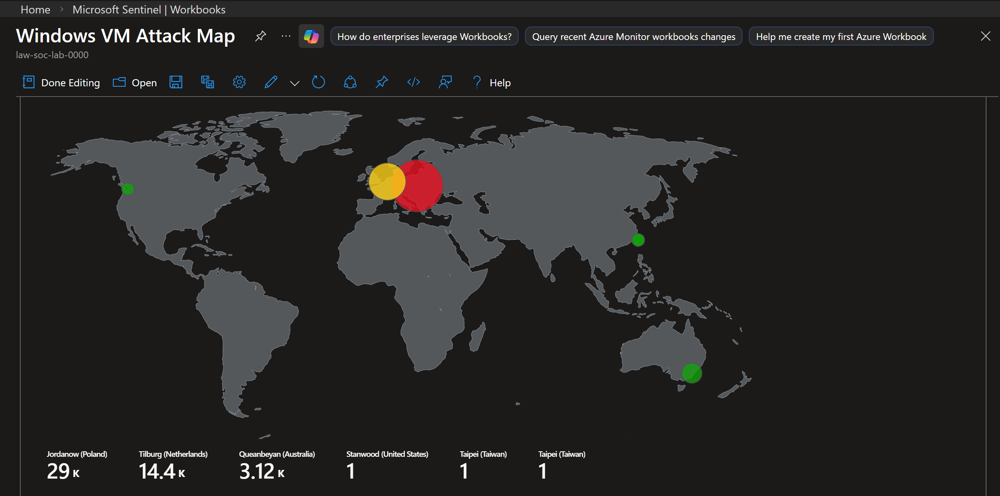

# Azure-Honeypot-SOC-Lab

A cloud-based SOC Honeypot project using Microsoft Sentinel to map global RDP brute-force attacks in real-time.

## 🎯 Project Overview

In this project, I stood up a live Honeypot in Microsoft Azure to observe and analyze real-world RDP brute-force attacks from across the globe. I deployed a Windows Virtual Machine, intentionally made it vulnerable, and utilized Microsoft Sentinel (SIEM) to ingest logs, map the geolocation of attackers, and visualize the threat landscape in real-time.

## 🛠️ Technologies Used

* *Microsoft Azure:* (Virtual Machines, Log Analytics Workspaces, Sentinel)
* *KQL (Kusto Query Language):* Used to query logs and build visualizations.
* *Network Security Groups:* Configured to intentionally allow malicious traffic.
* *Azure Monitor Agent:* For log collection from the Honeypot VM.

## 🚀 Step-by-Step Execution

1. *VM Deployment:* Created a Windows 10 VM and opened the firewall (NSG) to allow all inbound traffic.
2. *Log Collection:* Configured the Azure Monitoring Agent to forward Windows Event Logs (specifically Event ID 4625 - Failed Logons) to a Log Analytics Workspace.
3. *SIEM Setup:* Integrated the logs with Microsoft Sentinel and enriched them with geolocational data using a custom Watchlist.
4. *Visualization:* Developed an Attack Map Workbook to create a global heatmap of active attacks.

> [!TIP]
> You can view the KQL scripts used for this project in the [queries folder](./queries/).

## 📊 The Results

Within hours of the VM being live, it was hit by thousands of brute-force attempts from bots all over the world. 

The map above shows the live geolocated brute-force attempts targeting the Azure VM.

## 💡 Key Takeaway

This project provided hands-on experience with SIEM (Sentinel) and Log Analysis (KQL), demonstrating how quickly vulnerable assets are discovered on the public internet. It highlights the importance of the *Principle of Least Privilege* and proper Firewall/NSG configuration in cloud environments.
